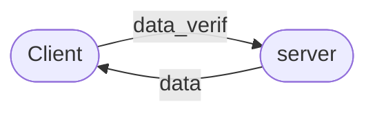

# project

- understand the network basics
- lerning about the nerwork protocoles
- understand the network library
- create a little piece of code that send data over network
- create a little piece of code that recieve data over network

allow to fetch the sound ambiance to set the corect color mode
maybe add the managing of the color by the controller with all wireless tech
